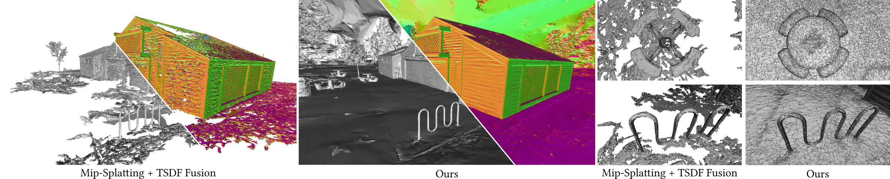

<p align="center">

  <h1 align="center">Gaussian Opacity Fields: Efficient and Compact Surface Reconstruction in Unbounded Scenes</h1>
  <p align="center">
    <a href="https://niujinshuchong.github.io/">Zehao Yu</a>
    ·
    <a href="https://tsattler.github.io/">Torsten Sattler</a>
    ·
    <a href="http://www.cvlibs.net/">Andreas Geiger</a>

  </p>
  <h3 align="center"><a href="https://drive.google.com/file/d/17YQQenJ9u4weTiadzTeQ_saF_zCMJfQ0/view?usp=sharing">Paper</a> | <a href="https://arxiv.org/pdf/2311.16493.pdf">arXiv</a> | <a href="https://niujinshuchong.github.io/gaussian-opacity-fields/">Project Page</a>  </h3>
  <div align="center"></div>
</p>


<p align="center">
  <a href="">
    
  </a>
</p>

<p align="center">
Gaussian Opacity Fields (GOF) enables geometry extraction with 3D Gaussians directly by indentifying its level set. Our regularization improves surface reconstruction and we utilize Marching Tetrahedra for compact and adaptive mesh extraction.</p>
<br>


# Installation
Clone the repository and create an anaconda environment using
```
git clone git@github.com:autonomousvision/gaussian-opacity-fields.git
cd gaussian-opacity-fields

conda create -y -n gof python=3.8
conda activate gof

pip install torch==1.12.1+cu113 torchvision==0.13.1+cu113 -f https://download.pytorch.org/whl/torch_stable.html
conda install cudatoolkit-dev=11.3 -c conda-forge

pip install -r requirements.txt

pip install submodules/diff-gaussian-rasterization
pip install submodules/simple-knn/
```

# Dataset

## Mip-NeRF 360 Dataset
Please download the data from the [Mip-NeRF 360](https://jonbarron.info/mipnerf360/) and request the authors for the treehill and flowers scenes.

# Training and Evaluation Comming soon

# Acknowledgements
This project is built upon [3DGS](https://github.com/graphdeco-inria/gaussian-splatting) and [Mip-Splatting](https://github.com/autonomousvision/mip-splatting). Regularizations are taken from [2DGS](https://surfsplatting.github.io/). Tetrahedra triangulation is taken from [Tetra-NeRF](https://github.com/jkulhanek/tetra-nerf). Marching Tetrahdedra is adapted from [Kaolin](https://github.com/NVIDIAGameWorks/kaolin/blob/master/kaolin/ops/conversions/tetmesh.py) Library. We thank all the authors for their great work and repos. 

# Citation
If you find our code or paper useful, please cite
```bibtex
@article{Yu2024GOF,
  author    = {Yu, Zehao and Sattler, Torsten and Geiger, Andreas},
  title     = {Gaussian Opacity Fields: Efficient High-quality Compact Surface Reconstruction in Unbounded Scenes},
  journal   = {arXiv},
  year      = {2024},
}
```
If you find the regularizations useful, please kindly cite
```
@article{Huang2DGS2024,
    author={Binbin Huang and Zehao Yu and Anpei Chen and Andreas Geiger and Shenghua Gao},
    title={2D Gaussian Splatting for Geometrically Accurate Radiance Fields},
    journal={arXiv},
    volume={2403.17888},
    year={2024}
}
```